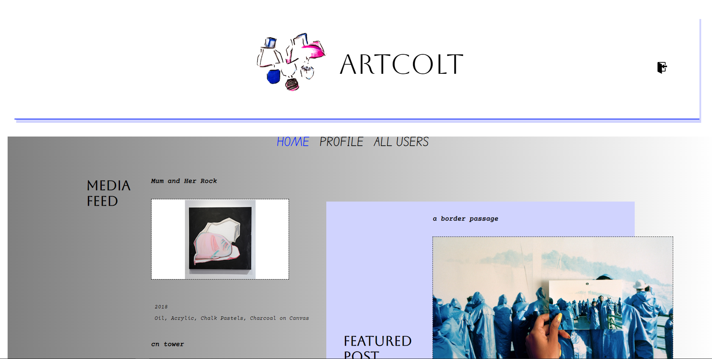
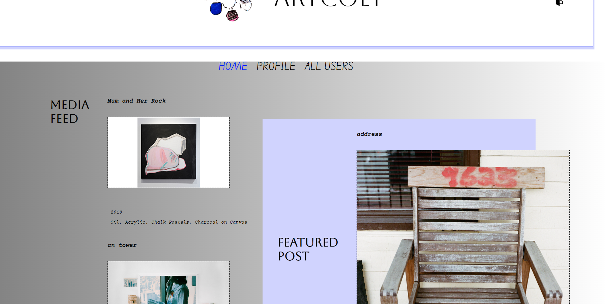
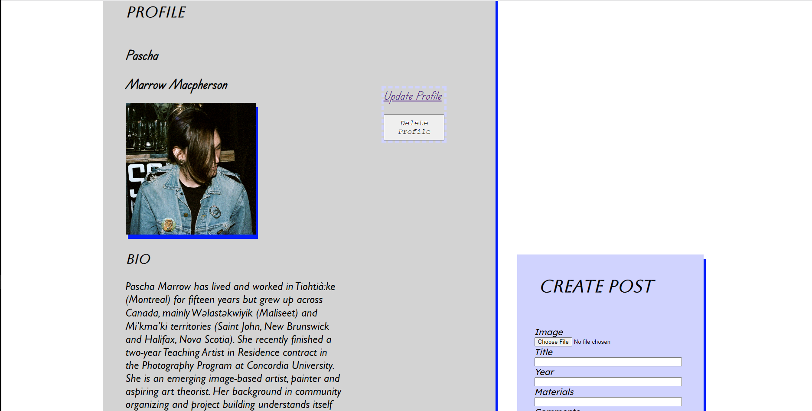

# artcolt
Final Project Concordia Web Dev Bootcamp 2022 - Networking Website for Art Educators 

art colt (connect/occupy/learn/teach) 

Service/Purpose: 

A web-space networking site where visual arts educators across the country are showcased in order to network and share teaching approaches, practices and resources, or just socially connect. 

Potential growth for future: A student and/or general artist login to support a wider visual arts clientele and audience.

Demo website: I have 6 real visual art educators as users for this mock-up website, including myself. I believe having real world examples of people will enhance the presentation of this concept as well as the visual experience of the site. 

Features: 

1) Users have secure sign-up with Auth0.
2) Users can edit (i.e.update) their profile, delete their profile and create media posts (i.e. image-posts) that are appear posted immediately. Data is stored in Mongo DB with additional usage of Cloudinary API.
3) Users can continually see new posts added to their HomePage Media Post Feed.
4) There is a featured artist/educator post that refreshes on each browser refresh of the site/home page.
5) The profile page for each user contains an archive of all of their image posts.

Additional Features if project is developed further:

- A commenting feature for users to offer comments on each other's posts or drop public comments or greetings into each other's Profile pages.
- A "favourited" posts area within each user's profile page that features media posts each user has bookmarked.
- A "similar" artists feature that finds other artists using similar methods, materials based on information within each user's profile data.
- A "following" feature to follow specific users and access their profiles faster from a "following" area on each user's Profile page.

 

