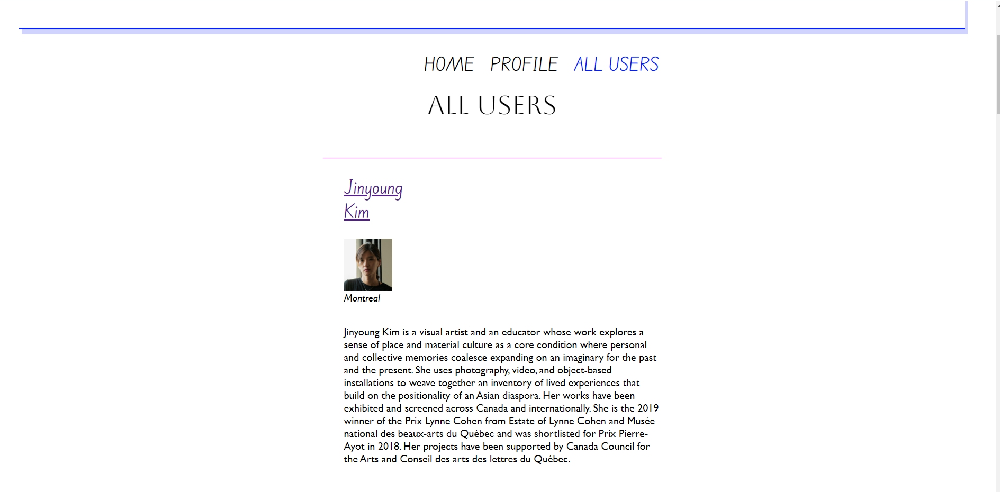

# artcolt
Final Project Concordia Web Dev Bootcamp 2022 - Networking Web Site for Art Educators

art colt (connect/occupy/learn/teach) 

Service/Purpose: 

A web-space networking site where visual arts educators across the country are showcased in order to network and share teaching approaches, practices and resources, or just socially connect. 

Potential growth for future: A student login and wider visual arts audience.

Demo website: I have 6 real visual art educators on the mock website including myself. I believe having real world examples of people will enhance the presentation of this concept as well as the visual experience of the site. 

Features: 

1) Users have secure sign-up with Auth0.
2) Users can edit (i.e.update) their profile, delete their profile and create media posts that are posted immediately and stored in MongoDB as well as Cloudinary API.
3) Users can continually see new posts added to their HomePage.
4) There is a featured artist/educator post that refreshes on each browser refresh of the site/home page.

 

